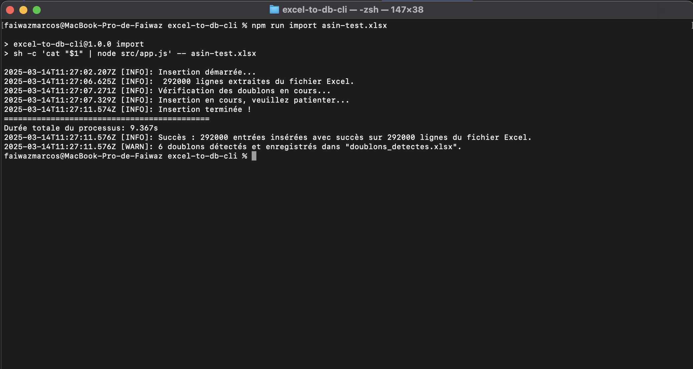

## Description 
Cette application en ligne de commande permet d'extraire des données d'un fichier Excel et de les insérer dans une base de données PostgreSQL. Elle détecte les doublons et enregistre ces derniers dans un fichier séparé pour une vérification ultérieure.


##  Fonctionnalités principales
-  **Lecture des données** : Extrait et analyse un fichier Excel passé via `stdin`.
-  **Validation des données** : Vérifie l'intégrité des entrées, détecte les valeurs invalides et normalise les formats de date.
-  **Détection des doublons** : Identifie les entrées avec le même matricule et les enregistre dans un fichier séparé `doublons_detectes.xlsx`.
-  **Correction du format des dates** : Analyse différents formats de dates et les normalise en format ISO (`YYYY-MM-DD`).
-  **Insertion optimisée en base de données** : Effectue des insertions en batch pour améliorer les performances.
-  **Affichage des statistiques d'exécution** : Nombre de lignes traitées, doublons détectés, succès et temps total d'exécution.


##  Prérequis
Avant d'exécuter ce script, assurez-vous d'avoir installé :

- **Node.js** (>= 18.x recommandé)
- **PostgreSQL** (Base de données configurée)
- **Dépendances du projet** (via `npm install`)

##  Installation

1. **Clonez le projet** :
   ```sh
   git clone https://github.com/fawazmarcos/excel-to-db-cli.git
   cd excel-to-db-cli
   ```

2. **Installez les dépendances** :
   ```sh
   npm install
   ```

3. **Configurez la base de données** :
   - Dupliquez le fichier `.env.example` et renommez-le en `.env`
   - Modifiez les variables selon votre configuration PostgreSQL :
     ```sh
     DB_HOST=localhost
     DB_PORT=5432
     DB_USER=votre_utilisateur
     DB_PASSWORD=votre_mot_de_passe
     DB_NAME=excel_db
     ```

4. **Exécutez les migrations de la base de données** :
   ```sh
   npm run migrate
   ```


##  Exécution

### 1️ Migration de la base de données
Avant de commencer, applique les migrations :
```sh
npm run migrate
```

### 2️ Exécuter l'importation depuis un fichier Excel
```sh
npm run import nom_du_fichier.xlsx
```

Cette commande vous épargne de devoir passer par la commande `cat` pour rediriger le contenu du fichier Excel vers `stdin` comme suit :
```sh
cat nom_du_fichier.xlsx | node src/app.js
```

Sous Windows :
Windows ne prend pas en charge la redirection de `stdin` de la même manière qu'Unix. Vous devez installer **Git Bash** ou **WSL (Windows Subsystem for Linux)** pour exécuter la commande ci-dessus.


###  Exécution avec un exemple
```sh
npm run import asin-test.xlsx
```


##  Exemple d'exécution

Voici un exemple d'exécution du script avec un fichier contenant 292 000 entrées :



###  Résultat attendu
```
Insertion démarrée...
292000 lignes extraites du fichier Excel.
Vérification des doublons en cours...
Insertion en cours, veuillez patienter...
Insertion terminée !
=========================
Durée totale du processus: 9.463s
Succès : 292000 entrées insérées avec succès sur 292000 lignes du fichier Excel.
6 doublons détectés et enregistrés dans "doublons_detectes.xlsx".
```


## Tests

Pour exécuter les tests unitaires et d'intégration, lance :
```sh
npm test
```


## Rollback de la base de données
Si besoin de revenir à l'état précédent :
```sh
npm run rollback
```


## Fonctionnement détaillé du code

### **1. Lecture et extraction des données**
- Le fichier Excel est lu depuis `stdin`.
- Les données sont extraites via `xlsx` et transformées en objets JSON.

### **2. Validation et correction des données**
- Vérification des champs obligatoires (`matricule`, `nom`, `prenom`, `status`, `datedenaissance`).
- Conversion des dates dans plusieurs formats (`dd/MM/yyyy`, `MM/dd/yyyy`, `yyyy-MM-dd`, etc.) vers le format ISO.
- Les entrées invalides sont rejetées avant insertion.

###  **3. Détection et gestion des doublons**
- Une analyse est effectuée sur les `matricules` pour identifier les doublons.
- Les doublons sont enregistrés dans un fichier Excel `doublons_detectes.xlsx` pour permettre une correction ultérieure.

###  **4. Insertion optimisée en base de données**
- Les entrées valides sont regroupées en lots de 5000 pour accélérer l'insertion.
- En cas d’erreur, un log est enregistré.

### **5. Documentation du projet avec TypeDoc**
- La documentation technique du code a été générée avec **TypeDoc**.
- Elle est accessible sous `docs/documentation`.
- Pour regénérer la documentation :
  ```sh
  npm run docs
  ```

##  Conclusion
Cette application permet d’importer rapidement et efficacement un fichier Excel dans une base de données, en s’assurant que les données sont valides et correctement formatées. 


###  Auteur
Projet développé par **Faiwaz Marcos---- Email: marcosfaiwaz@gmail.com**


